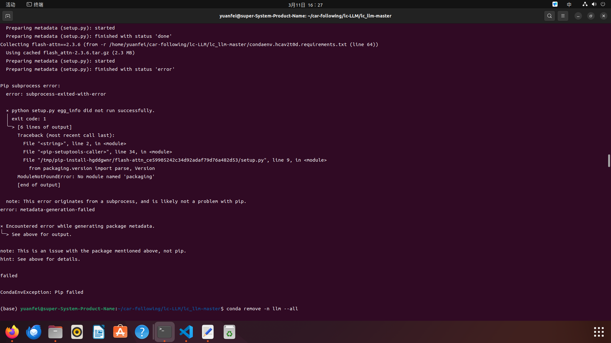
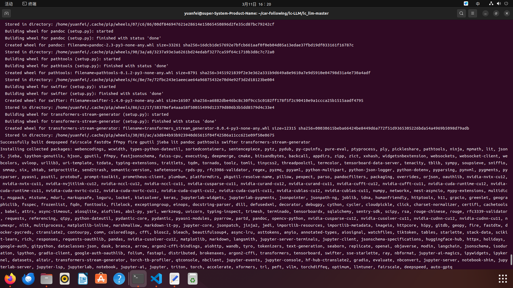
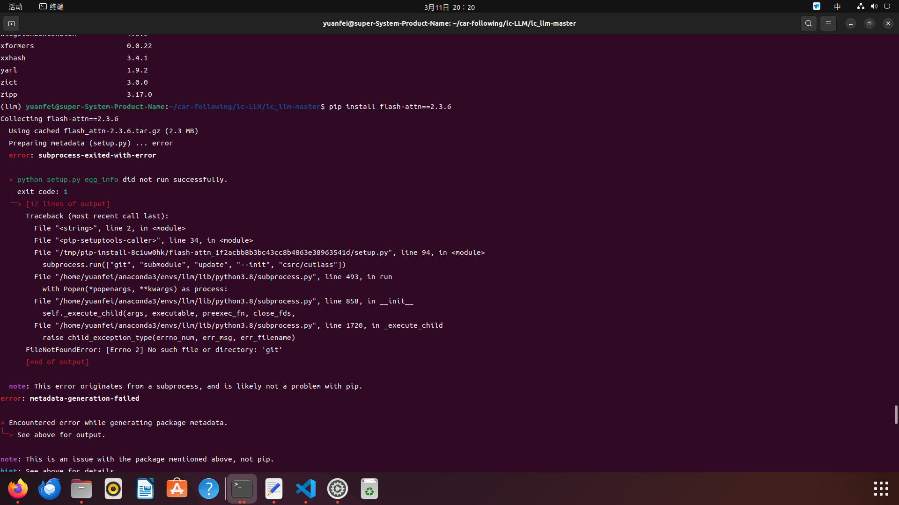
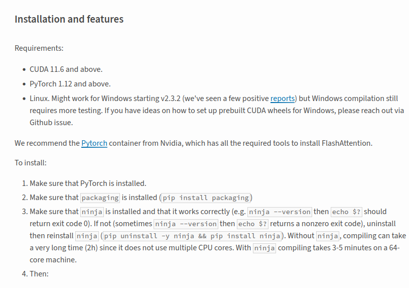

### 2024.3.10
#### 环境配置：
根据readme文件显示，在base环境使用```conda env create -f environment.yaml -n lc_llm```命令根据创建**environment.yaml**文件中包含的库创建lc_llm环境,运行时出现报错，报错信息如下：
```
  Preparing metadata (setup.py): started
  Preparing metadata (setup.py): finished with status 'error'

Pip subprocess error:
  error: subprocess-exited-with-error
  
  × python setup.py egg_info did not run successfully.
  │ exit code: 1
  ╰─> [6 lines of output]
      Traceback (most recent call last):
        File "<string>", line 2, in <module>
        File "<pip-setuptools-caller>", line 34, in <module>
        File "/tmp/pip-install-2eobx_jr/flash-attn_35a12ec663d84bdc9a0efefeb15a4a65/setup.py", line 9, in <module>
          from packaging.version import parse, Version
      ModuleNotFoundError: No module named 'packaging'
      [end of output]
  
  note: This error originates from a subprocess, and is likely not a problem with pip.
error: metadata-generation-failed

× Encountered error while generating package metadata.
╰─> See above for output.

note: This is an issue with the package mentioned above, not pip.
hint: See above for details.

failed

CondaEnvException: Pip failed

```
初步判断原因可能是：
```
Pip subprocess error:
  error: subprocess-exited-with-error
  
  × python setup.py egg_info did not run successfully.
```
查询原因，尝试运行```pip install --upgrade pip setuptools==57.5.0```，[reference网址](https://zhuanlan.zhihu.com/p/633849365)，运行过程中进显示信息如下：
```
(base) yuanfei@super-System-Product-Name:~/car-following/lc-LLM/lc_llm-master$ pip install --upgrade pip setuptools==57.5.0
Requirement already satisfied: pip in /home/yuanfei/anaconda3/lib/python3.11/site-packages (23.3.1)
Collecting pip
  Downloading pip-24.0-py3-none-any.whl.metadata (3.6 kB)
Collecting setuptools==57.5.0
  Downloading setuptools-57.5.0-py3-none-any.whl.metadata (4.9 kB)
Downloading setuptools-57.5.0-py3-none-any.whl (819 kB)
   ━━━━━━━━━━━━━━━━━━━━━━━━━━━━━━━━━━━━━━━━ 819.3/819.3 kB 452.9 kB/s eta 0:00:00
Downloading pip-24.0-py3-none-any.whl (2.1 MB)
   ━━━━━━━━━━━━━━━━━━━━━━━━━━━━━━━━━━━━━━━━ 2.1/2.1 MB 153.5 kB/s eta 0:00:00
Installing collected packages: setuptools, pip
  Attempting uninstall: setuptools
    Found existing installation: setuptools 68.2.2
    Uninstalling setuptools-68.2.2:
      Successfully uninstalled setuptools-68.2.2
  Attempting uninstall: pip
    Found existing installation: pip 23.3.1
    Uninstalling pip-23.3.1:
      Successfully uninstalled pip-23.3.1
ERROR: pip's dependency resolver does not currently take into account all the packages that are installed. This behaviour is the source of the following dependency conflicts.
conda-repo-cli 1.0.75 requires requests_mock, which is not installed.
anaconda-client 1.12.3 requires setuptools>=58.0.4, but you have setuptools 57.5.0 which is incompatible.
conda-repo-cli 1.0.75 requires clyent==1.2.1, but you have clyent 1.2.2 which is incompatible.
conda 24.1.2 requires setuptools>=60.0.0, but you have setuptools 57.5.0 which is incompatible.
Successfully installed pip-24.0 setuptools-57.5.0

```
### 2024.3.11
后续将尝试删除环境重新运行```conda remove --name lc_llm --all```,  ，运行依旧报错。
再次查询资料，资料显示在安装**flash-attn==2.3.6**库时，因为缺少'packaging'模块，导致安装失败。

首先尝试将yaml文件中的```     - packaging==23.2```移到前面尝试重新创建环境。结果依旧不成功。于是先暂时不安装<font color=red>flash-attn</font>,将其从yaml文件中删除。后续手动添加。
成功安装

```
Package                       Version
----------------------------- ------------
absl-py                       2.0.0
accelerate                    0.23.0
aiofiles                      23.2.1
aiohttp                       3.8.6
aiosignal                     1.3.1
aiosqlite                     0.19.0
altair                        5.2.0
annotated-types               0.6.0
anyio                         3.7.1
appdirs                       1.4.4
argon2-cffi                   23.1.0
argon2-cffi-bindings          21.2.0
arrow                         1.3.0
asttokens                     2.4.0
async-lru                     2.0.4
async-timeout                 4.0.3
attrs                         23.1.0
auto-gptq                     0.4.2
Babel                         2.13.0
backcall                      0.2.0
beautifulsoup4                4.12.2
bitsandbytes                  0.41.1
bleach                        6.1.0
blosc2                        2.0.0
branca                        0.6.0
brokenaxes                    0.5.0
cachetools                    5.3.1
certifi                       2023.7.22
cffi                          1.16.0
charset-normalizer            3.3.0
click                         8.1.7
cloudpickle                   3.0.0
cmake                         3.27.7
coloredlogs                   15.0.1
comm                          0.1.4
contourpy                     1.1.1
ctranslate2                   3.20.0
cycler                        0.12.1
Cython                        3.0.4
dask                          2023.5.0
dataclasses-json              0.6.3
datasets                      2.14.5
debugpy                       1.8.0
decorator                     5.1.1
deepmerge                     1.1.0
deepspeed                     0.12.3
defusedxml                    0.7.1
dill                          0.3.7
distributed                   2023.5.0
docker-pycreds                0.4.0
docstring-parser              0.15
einops                        0.7.0
evaluate                      0.4.1
exceptiongroup                1.1.3
executing                     2.0.0
fairscale                     0.4.13
faiss-cpu                     1.7.4
fastapi                       0.104.0
fastdtw                       0.3.4
fastjsonschema                2.18.1
ffmpy                         0.3.1
filelock                      3.12.4
fire                          0.5.0
folium                        0.14.0
fonttools                     4.43.1
fqdn                          1.5.1
frozenlist                    1.4.0
fsspec                        2023.6.0
geographiclib                 2.0
geopy                         2.4.0
gitdb                         4.0.11
GitPython                     3.1.40
google-auth                   2.23.3
google-auth-oauthlib          1.0.0
GPUtil                        1.4.0
gradio                        3.50.2
gradio_client                 0.6.1
greenlet                      3.0.1
grpcio                        1.59.0
h11                           0.14.0
h5py                          3.10.0
hf-hub-ctranslate2            2.12.0
hjson                         3.1.0
holidays                      0.36
httpcore                      1.0.2
httptools                     0.6.1
httpx                         0.25.1
huggingface-hub               0.20.3
humanfriendly                 10.0
idna                          3.4
imageio                       2.33.1
importlib-metadata            6.8.0
importlib-resources           6.1.0
ipykernel                     6.25.2
ipython                       8.12.3
ipython-genutils              0.2.0
ipywidgets                    8.1.1
isoduration                   20.11.0
jedi                          0.19.1
jieba                         0.42.1
Jinja2                        3.1.2
joblib                        1.3.2
json5                         0.9.14
jsonpatch                     1.33
jsonpath-ng                   1.6.0
jsonpointer                   2.4
jsonschema                    4.19.1
jsonschema-specifications     2023.7.1
jupyter                       1.0.0
jupyter_ai                    2.6.0
jupyter_ai_magics             2.6.0
jupyter_client                8.4.0
jupyter-console               6.6.3
jupyter_core                  5.4.0
jupyter-events                0.8.0
jupyter-lsp                   2.2.0
jupyter_server                2.8.0
jupyter_server_terminals      0.4.4
jupyterlab                    4.0.7
jupyterlab-pygments           0.2.2
jupyterlab_server             2.25.0
jupyterlab-widgets            3.0.9
keras                         2.15.0
kiwisolver                    1.4.5
langchain                     0.0.318
langsmith                     0.0.69
lit                           17.0.3
llmtuner                      0.5.1
locket                        1.0.0
loguru                        0.7.2
Markdown                      3.5
markdown-it-py                3.0.0
MarkupSafe                    2.1.3
marshmallow                   3.20.1
matplotlib                    3.7.3
matplotlib-inline             0.1.6
mdurl                         0.1.2
mistune                       3.0.2
modin                         0.23.1.post0
mpmath                        1.3.0
msgpack                       1.0.7
multidict                     6.0.4
multiprocess                  0.70.15
mypy-extensions               1.0.0
nbclient                      0.8.0
nbconvert                     7.9.2
nbformat                      5.9.2
nest-asyncio                  1.5.8
networkx                      3.1
ninja                         1.11.1.1
nltk                          3.8.1
notebook                      7.0.6
notebook_shim                 0.2.3
numexpr                       2.8.6
numpy                         1.24.4
nvidia-cublas-cu11            11.10.3.66
nvidia-cublas-cu12            12.1.3.1
nvidia-cuda-cupti-cu11        11.7.101
nvidia-cuda-cupti-cu12        12.1.105
nvidia-cuda-nvrtc-cu11        11.7.99
nvidia-cuda-nvrtc-cu12        12.1.105
nvidia-cuda-runtime-cu11      11.7.99
nvidia-cuda-runtime-cu12      12.1.105
nvidia-cudnn-cu11             8.5.0.96
nvidia-cudnn-cu12             8.9.2.26
nvidia-cufft-cu11             10.9.0.58
nvidia-cufft-cu12             11.0.2.54
nvidia-curand-cu11            10.2.10.91
nvidia-curand-cu12            10.3.2.106
nvidia-cusolver-cu11          11.4.0.1
nvidia-cusolver-cu12          11.4.5.107
nvidia-cusparse-cu11          11.7.4.91
nvidia-cusparse-cu12          12.1.0.106
nvidia-nccl-cu11              2.14.3
nvidia-nccl-cu12              2.18.1
nvidia-nvjitlink-cu12         12.3.52
nvidia-nvtx-cu11              11.7.91
nvidia-nvtx-cu12              12.1.105
oauthlib                      3.2.2
objaverse                     0.1.7
openai                        0.28.1
opencv-python                 4.8.1.78
optimum                       1.15.0
orjson                        3.9.12
overrides                     7.4.0
packaging                     23.2
pandas                        2.0.3
pandoc                        2.3
pandocfilters                 1.5.0
parso                         0.8.3
partd                         1.4.1
pathtools                     0.1.2
peft                          0.7.1
pexpect                       4.8.0
pickleshare                   0.7.5
Pillow                        10.1.0
pip                           23.3
pkgutil_resolve_name          1.3.10
platformdirs                  3.11.0
plumbum                       1.8.2
ply                           3.11
prometheus-client             0.17.1
prompt-toolkit                3.0.39
protobuf                      3.20.0
psutil                        5.9.6
ptyprocess                    0.7.0
pure-eval                     0.2.2
py-cpuinfo                    9.0.0
pyarrow                       13.0.0
pyasn1                        0.5.0
pyasn1-modules                0.3.0
pycparser                     2.21
pydantic                      1.10.13
pydantic_core                 2.10.1
pydub                         0.25.1
Pygments                      2.16.1
pynvml                        11.5.0
pyparsing                     3.1.1
python-dateutil               2.8.2
python-dotenv                 1.0.0
python-json-logger            2.0.7
python-multipart              0.0.6
pytz                          2023.3.post1
PyYAML                        6.0.1
pyzmq                         25.1.1
qtconsole                     5.4.4
QtPy                          2.4.0
ray                           2.7.1
referencing                   0.30.2
regex                         2023.10.3
replicate                     0.20.0
requests                      2.31.0
requests-oauthlib             1.3.1
responses                     0.18.0
rfc3339-validator             0.1.4
rfc3986-validator             0.1.1
rich                          13.6.0
rouge                         1.0.1
rouge-chinese                 1.0.3
rpds-py                       0.10.6
rsa                           4.9
safetensors                   0.4.0
scikit-learn                  1.3.2
scipy                         1.10.1
seaborn                       0.13.0
semantic-version              2.10.0
Send2Trash                    1.8.2
sentencepiece                 0.1.99
sentry-sdk                    1.32.0
setproctitle                  1.3.3
setuptools                    68.0.0
shtab                         1.6.4
six                           1.16.0
smmap                         5.0.1
sniffio                       1.3.0
sortedcontainers              2.4.0
soupsieve                     2.5
SQLAlchemy                    2.0.23
sse-starlette                 1.8.2
stack-data                    0.6.3
starlette                     0.27.0
swifter                       1.4.0
sympy                         1.12
tables                        3.8.0
tblib                         3.0.0
tenacity                      8.2.3
tensorboard                   2.14.0
tensorboard-data-server       0.7.1
tensorboardX                  2.6.2.2
termcolor                     2.3.0
terminado                     0.17.1
text-generation               0.6.1
threadpoolctl                 3.2.0
tiktoken                      0.5.2
tinycss2                      1.2.1
tokenizers                    0.15.1
tomli                         2.0.1
toolz                         0.12.0
torch                         2.0.1
torch-tb-profiler             0.4.3
torchdiffeq                   0.2.3
tornado                       6.3.3
tqdm                          4.66.1
traitlets                     5.11.2
transformers                  4.37.0
transformers-stream-generator 0.0.4
trimesh                       4.0.5
triton                        2.0.0
trl                           0.7.10
types-python-dateutil         2.8.19.14
typing_extensions             4.8.0
typing-inspect                0.9.0
tyro                          0.7.0
tzdata                        2023.3
uri-template                  1.3.0
urllib3                       2.0.7
uvicorn                       0.23.2
uvloop                        0.19.0
vllm                          0.2.1.post1
wandb                         0.16.0
watchfiles                    0.21.0
wcwidth                       0.2.8
webcolors                     1.13
webencodings                  0.5.1
websocket-client              1.6.4
websockets                    11.0.3
Werkzeug                      3.0.0
wheel                         0.41.2
widgetsnbextension            4.0.9
xformers                      0.0.22
xxhash                        3.4.1
yarl                          1.9.2
zict                          3.0.0
zipp                          3.17.0

```
#### 记录（关于flash-attn==2.3.6）
其余库都安装完毕，flash-attn==2.3.6库仍然安装出现问题
，按照显示，通过```sudo apt-get install git```安装git，随后继续重新安装flash-attn==2.3.6
仍然出现问题：
```
(llm) yuanfei@super-System-Product-Name:~/car-following/lc-LLM/lc_llm-master$ pip install flash-attn==2.3.6
Collecting flash-attn==2.3.6
  Using cached flash_attn-2.3.6.tar.gz (2.3 MB)
  Preparing metadata (setup.py) ... error
  error: subprocess-exited-with-error
  
  × python setup.py egg_info did not run successfully.
  │ exit code: 1
  ╰─> [20 lines of output]
      fatal: 不是 git 仓库（或者任何父目录）：.git
      /tmp/pip-install-xjjtr5k8/flash-attn_a5818fec23644f44a7eb4e93278f2751/setup.py:78: UserWarning: flash_attn was requested, but nvcc was not found.  Are you sure your environment has nvcc available?  If you're installing within a container from https://hub.docker.com/r/pytorch/pytorch, only images whose names contain 'devel' will provide nvcc.
        warnings.warn(
      Traceback (most recent call last):
        File "<string>", line 2, in <module>
        File "<pip-setuptools-caller>", line 34, in <module>
        File "/tmp/pip-install-xjjtr5k8/flash-attn_a5818fec23644f44a7eb4e93278f2751/setup.py", line 133, in <module>
          CUDAExtension(
        File "/home/yuanfei/anaconda3/envs/llm/lib/python3.8/site-packages/torch/utils/cpp_extension.py", line 1048, in CUDAExtension
          library_dirs += library_paths(cuda=True)
        File "/home/yuanfei/anaconda3/envs/llm/lib/python3.8/site-packages/torch/utils/cpp_extension.py", line 1179, in library_paths
          if (not os.path.exists(_join_cuda_home(lib_dir)) and
        File "/home/yuanfei/anaconda3/envs/llm/lib/python3.8/site-packages/torch/utils/cpp_extension.py", line 2223, in _join_cuda_home
          raise EnvironmentError('CUDA_HOME environment variable is not set. '
      OSError: CUDA_HOME environment variable is not set. Please set it to your CUDA install root.
      
      
      torch.__version__  = 2.0.1+cu117
      
      
      [end of output]
  
  note: This error originates from a subprocess, and is likely not a problem with pip.
error: metadata-generation-failed

× Encountered error while generating package metadata.
╰─> See above for output.

note: This is an issue with the package mentioned above, not pip.
hint: See above for details.
(llm) yuanfei@super-System-Product-Name:~/car-following/lc-LLM/lc_llm-master$ pip install flash-attn==2.3.6
Collecting flash-attn==2.3.6
  Using cached flash_attn-2.3.6.tar.gz (2.3 MB)
  Preparing metadata (setup.py) ... error
  error: subprocess-exited-with-error
  
  × python setup.py egg_info did not run successfully.
  │ exit code: 1
  ╰─> [12 lines of output]
      fatal: 不是 git 仓库（或者任何父目录）：.git
      Traceback (most recent call last):
        File "<string>", line 2, in <module>
        File "<pip-setuptools-caller>", line 34, in <module>
        File "/tmp/pip-install-7gv7p569/flash-attn_99114eaeeeb145829d88d6f30f4439e9/setup.py", line 114, in <module>
          raise RuntimeError(
      RuntimeError: FlashAttention is only supported on CUDA 11.6 and above.  Note: make sure nvcc has a supported version by running nvcc -V.
      
      
      torch.__version__  = 2.0.1+cu117
      
      
      [end of output]
  
  note: This error originates from a subprocess, and is likely not a problem with pip.
error: metadata-generation-failed

× Encountered error while generating package metadata.
╰─> See above for output.

note: This is an issue with the package mentioned above, not pip.
hint: See above for details.

```
通过nvcc -version查询CUDA编译器版本，显示
```
找不到命令 “nvcc”，但可以通过以下软件包安装它：
sudo apt install nvidia-cuda-toolkit
```
安装好后进行查询，显示

但是我通过nvidia-smi查询出来是

而且根据[关于flash-attn==2.3.6](https://pypi.org/project/flash-attn/)显示，需要CUDA11.6以上。

暂时放弃安装flash-attn==2.3.6，看后续是否会出问题。出问题再重新安装[后续尝试这个方法](https://juejin.cn/post/7277802797470580771)


### 2024.3.12
#### 复现LC_extraction.py
首先复现的是LC_extraction.py，将代码中的路径改为highD数据集所在的路径，发现data数据集中并无pickle文件夹，暂时注释运行

，运行过程中有问题，
```
/home/yuanfei/anaconda3/envs/llm/bin/python /home/yuanfei/PycharmProjects/lc_llm/lc_llm-master/process_highD/LC_extraction-new.py 
Try to find the saved pickle file for better performance.
Pickle file not found, csv will be imported now.
Traceback (most recent call last):
  File "/home/yuanfei/PycharmProjects/lc_llm/lc_llm-master/process_highD/LC_extraction-new.py", line 100, in <module>
    tracks = read_track_csv(created_arguments)
  File "/home/yuanfei/PycharmProjects/lc_llm/lc_llm-master/process_highD/data_management/read_csv.py", line 74, in read_track_csv
    df = pandas.read_csv(arguments["input_path"])
  File "/home/yuanfei/anaconda3/envs/llm/lib/python3.8/site-packages/pandas/io/parsers/readers.py", line 912, in read_csv
    return _read(filepath_or_buffer, kwds)
  File "/home/yuanfei/anaconda3/envs/llm/lib/python3.8/site-packages/pandas/io/parsers/readers.py", line 577, in _read
    parser = TextFileReader(filepath_or_buffer, **kwds)
  File "/home/yuanfei/anaconda3/envs/llm/lib/python3.8/site-packages/pandas/io/parsers/readers.py", line 1407, in __init__
    self._engine = self._make_engine(f, self.engine)
  File "/home/yuanfei/anaconda3/envs/llm/lib/python3.8/site-packages/pandas/io/parsers/readers.py", line 1661, in _make_engine
    self.handles = get_handle(
  File "/home/yuanfei/anaconda3/envs/llm/lib/python3.8/site-packages/pandas/io/common.py", line 859, in get_handle
    handle = open(
FileNotFoundError: [Errno 2] No such file or directory: '/home/yuanfei/data/data/01_tracks.csv'

Process finished with exit code 1
```
换成一个原始**LC_extraction.py**代码，将**data**文件夹移到*LC_extraction.py**上一级目录，同级目录建立一个output_data,再次运行。程序成功运行。
运行完发现在data文件夹多了.pickle文件，尝试将所有的文件打包成pickle文件夹，重新运行原来的**LC_extraction.py**代码（重命名为LC_extraction-new.py）,运行后代码成功运行。

###
#### LC_extraction.py学习笔记1

这段代码主要是用于从多个文件中提取数据，并进行一些处理后保存。下面是对代码的解释：

created_arguments = create_args()

创建了一个名为created_arguments的变量，通过调用create_args()函数来初始化参数。
for file_idx in range(1, 61):

遍历60个文件，文件编号从1到60。

文件路径设置：  
根据文件编号构建各个文件的路径，包括输入路径、静态信息路径、元数据路径、pickle文件路径和背景图像路径。

读取数据：  
尝试查找保存的pickle文件以提高性能，如果存在则直接加载，否则从csv文件导入数据，并保存为pickle文件。

处理静态信息和元数据：  
分别读取静态信息和元数据，如果文件缺失或包含不正确的字符则报错并退出。

提取数据：  
获取帧率，若不为25则提示数据帧率不正确。
构建当前场景信息和选定车辆数据列表。
针对每辆车辆进行处理，选择符合条件的目标车辆，提取相关数据片段。
构建包括目标车辆和周围车辆信息的数据片段列表。

保存数据：  
将当前场景提取的数据保存为.pkl文件，文件名包括文件编号。

### 2024.3.14
[近期总结](https://docs.qq.com/slide/DSFFCS0trWG9NaEVo)

### 2024.3.15
#### 复现create_data.py
安装ndjson库，```pip install ndjson```
对路径作出以下修改
```
        left_file = f"./output_data/{datatype}/{timpesplit}/left_extracted_data_{num_str}.pkl"
        right_file = f"./output_data/{datatype}/{timpesplit}/right_extracted_data_{num_str}.pkl"
        straight_file = f"./output_data/{datatype}/straight/straight_extracted_data_{num_str}.pkl"

```
改为：
```
        left_file = f"../process_highD/output_data/{datatype}/{timpesplit}/left_extracted_data_{num_str}.pkl"
        right_file = f"../process_highD/output_data/{datatype}/{timpesplit}/right_extracted_data_{num_str}.pkl"
        straight_file = f"../process_highD/output_data/{datatype}/straight/straight_extracted_data_{num_str}.pkl"

```

```
    pickle.dump(datasets, open(f"./output_data/{datatype}/{timpesplit}/extracted_data.pkl", 'wb'))
```
改为：
```
    pickle.dump(datasets, open(f"../process_highD/output_data/{datatype}/{timpesplit}/extracted_data.pkl", 'wb'))
```
```
        llm_data_path = f"./llm_data/{timesplit}"
        if not os.path.exists(llm_data_path):
            os.makedirs(llm_data_path)
        if is_train:
            datatype = "train"
            train_path = f"./output_data/train/{timesplit}/extracted_data.pkl" 
            if not os.path.exists(train_path):
                datasets = merge_data(datatype, timesplit)
            else:
                datasets = pickle.load(open(train_path, 'rb'))
        else:
            datatype = "val" 
            val_path = f"./output_data/val/{timesplit}/extracted_data.pkl"  
            if not os.path.exists(val_path):
                datasets = merge_data(datatype, timesplit)
            else:
                datasets = pickle.load(open(val_path, 'rb'))
        encoding = tiktoken.encoding_for_model("gpt-3.5-turbo")

```
改为：
```
        llm_data_path = f"./llm_data/{timesplit}"
        if not os.path.exists(llm_data_path):
            os.makedirs(llm_data_path)

        if is_train:
            datatype = "train"
            train_path = f"../process_highD/output_data/train/{timesplit}/extracted_data.pkl"
            if not os.path.exists(train_path):
                datasets = merge_data(datatype, timesplit)
            else:
                datasets = pickle.load(open(train_path, 'rb'))
        else:
            datatype = "val" 
            val_path = f"../process_highD/output_data/val/{timesplit}/extracted_data.pkl"
            if not os.path.exists(val_path):
                datasets = merge_data(datatype, timesplit)
            else:
                datasets = pickle.load(open(val_path, 'rb'))
        encoding = tiktoken.encoding_for_model("gpt-3.5-turbo")

```
运行时，内存爆炸初步定位是在
```
        left_data = pickle.load(open(left_file, 'rb'))
        right_data = pickle.load(open(right_file, 'rb'))
        straight_data = pickle.load(open(straight_file, 'rb'))
        print("hi", i)
        for i in range(len(left_data['pieces'])):
            left.append({"scene": left_data['scene'], "pieces": left_data['pieces'][i]})
        for i in range(len(right_data['pieces'])):
            right.append({"scene": right_data['scene'], "pieces": right_data['pieces'][i]})
        for i in range(len(straight_data['pieces'])):
            straight.append({"scene": straight_data['scene'], "pieces": straight_data['pieces'][i]})

```
代码两层循环，将处理好的数据全部加载到了left、right、straight上，导致内存不足，尝试修改代码，分批次处理数据。

### 2024.3.18

#### 原代码主体框架
1. 主函数调用create_llm_data()函数
2. create_llm_data()函数：   
    1. 设置变量
    2. 遍历output_data/train(val)/中1-5s文件夹中的数据
    3. 设置llm_data_path，如果不存在，则建一个路径
    4. 判断是否是“train”，设置路径（根据is_train作出相应更改），如果没有对应路径的pkl文件则调用merge_data(),反之则使用pickle.load()下载相应的pkl文件
    5. merge_data():
        1. 变量设置，根据datatype选择类型并修改相应的参数
        2. 遍历1-50(训练集)/51-60(验证集)的文件(左变道、右变道、直行)，将其中的数据按照分类分别存入left、right、straight
        3. 按照num_limit分别随机在left、right、straight中提取相应数量的left_sample、right_sample、straight_sample
        4. 最终将其添加到datasets中
    6. 文本数据编码，编码成适合gpt-3.5-turbo的格式
    7. 设置变量
    8. 遍历datasets
        1. 根据每个dataset调用generate_user_message_intention_traj_2()、generate_assistant_message_intention_traj()、system_message_intention_traj
        2. 输出消息
        3. 计算不同类型token数
        4. 将system_message、user_message、assitant_message添加到train_message和llama_train中，最终添加到train_messages、llama_train_messages
     9. 如果time_int>1:(即从第2s数据集开始，第1s数据不做处理)
        1. pre_timesplit = str(time_int - 1) + "s" eg.:2s->1s,3s->2s,1s->1s
        2. 打开./llm_data/{pre_timesplit}/{datatype}_{prompt_type}.json，即打开上次运行结束的json文件
        3. 遍历全部文件，将每次遍历的文件通过json.load()添加到new_train_messages
        4. 将train_messages中元素添加到另一个列表new_train_messages的尾部
        5. 将new_train_messages赋值给train_messages
     10. 将train_messages添加到./llm_data/{timesplit}/{datatype}_{prompt_type}.json(llama类似操作)


#### 修改后代码主体框架
1. 主函数调用create_llm_data()函数
2. create_llm_data()函数：   
    1. 设置变量
    2. 遍历output_data/train(val)/中1-5s文件夹中的数据
    3. 设置llm_data_path，如果不存在，则建一个路径
    4. 判断是否是“train”，设置路径（根据is_train作出相应更改），如果没有对应路径的pkl文件则调用merge_data(),反之则使用pickle.load()下载相应的pkl文件
    5. 遍历begin_index到end_index-1(训练集：1-50，验证集：51-60)的文件
        1. 设置train_path
        2. 如果没有对应路径的pkl文件则调用merge_data(),反之则使用pickle.load()下载相应的pkl文件
        3. merge_data():
            1. 变量设置
            2. 按照左变道、右变道、直行文件路径读取相应的数据到left、right、straight
            3. 将left、right、straight合并到datasets并返回datasets
        4. 文本数据编码，编码成适合gpt-3.5-turbo的格式
        5. 设置变量
        6. 遍历datasets
            1. 根据每个dataset调用generate_user_message_intention_traj_2()、generate_assistant_message_intention_traj()、system_message_intention_traj
            2. 输出消息
            3. 计算不同类型token数
            4. 构建消息字典：将system_message、user_message、assitant_message添加到train_message和llama_train中，最终添加到train_messages、llama_train_messages
    6. 如果time_int>1:(即从第2s数据集开始，第1s数据不做处理)
        1. pre_timesplit = str(time_int - 1) + "s" eg.:2s->1s,3s->2s,1s->1s
        2. 打开./llm_data/{pre_timesplit}/{datatype}_{prompt_type}.json，即打开上次运行结束的json文件
        3. 遍历全部文件，将每次遍历的文件通过json.load()添加到new_train_messages
        4.  将train_messages中元素添加到另一个列表new_train_messages的尾部
        5.  将new_train_messages赋值给train_messages
    7.  将train_messages添加到./llm_data/{timesplit}/{datatype}_{prompt_type}.json(llama类似操作)

### 2024.3.19
激活llm环境，运行```./finetune_lora.sh```文件，首次运行可能报错，显示缺少c++编译器,安装GCC即可。第二次运行报错如下：
```
[INFO|integration_utils.py:722] 2024-03-19 20:35:48,712 >> Automatic Weights & Biases logging enabled, to disable set os.environ["WANDB_DISABLED"] = "true"
wandb: ERROR api_key not configured (no-tty). call wandb.login(key=[your_api_key])
Traceback (most recent call last):
  File "finetune_lora.py", line 702, in <module>
    main()
  File "finetune_lora.py", line 663, in main
    train_result = trainer.train(resume_from_checkpoint=checkpoint)
  File "/home/yuanfei/anaconda3/envs/llm/lib/python3.8/site-packages/transformers/trainer.py", line 1539, in train
    return inner_training_loop(
  File "/home/yuanfei/anaconda3/envs/llm/lib/python3.8/site-packages/transformers/trainer.py", line 1787, in _inner_training_loop
    self.control = self.callback_handler.on_train_begin(args, self.state, self.control)
  File "/home/yuanfei/anaconda3/envs/llm/lib/python3.8/site-packages/transformers/trainer_callback.py", line 370, in on_train_begin
    return self.call_event("on_train_begin", args, state, control)
  File "/home/yuanfei/anaconda3/envs/llm/lib/python3.8/site-packages/transformers/trainer_callback.py", line 414, in call_event
    result = getattr(callback, event)(
  File "/home/yuanfei/anaconda3/envs/llm/lib/python3.8/site-packages/transformers/integrations/integration_utils.py", line 767, in on_train_begin
    self.setup(args, state, model, **kwargs)
  File "/home/yuanfei/anaconda3/envs/llm/lib/python3.8/site-packages/transformers/integrations/integration_utils.py", line 740, in setup
    self._wandb.init(
  File "/home/yuanfei/anaconda3/envs/llm/lib/python3.8/site-packages/wandb/sdk/wandb_init.py", line 1185, in init
    raise e
  File "/home/yuanfei/anaconda3/envs/llm/lib/python3.8/site-packages/wandb/sdk/wandb_init.py", line 1162, in init
    wi.setup(kwargs)
  File "/home/yuanfei/anaconda3/envs/llm/lib/python3.8/site-packages/wandb/sdk/wandb_init.py", line 306, in setup
    wandb_login._login(
  File "/home/yuanfei/anaconda3/envs/llm/lib/python3.8/site-packages/wandb/sdk/wandb_login.py", line 298, in _login
    wlogin.prompt_api_key()
  File "/home/yuanfei/anaconda3/envs/llm/lib/python3.8/site-packages/wandb/sdk/wandb_login.py", line 228, in prompt_api_key
    raise UsageError("api_key not configured (no-tty). call " + directive)
wandb.errors.UsageError: api_key not configured (no-tty). call wandb.login(key=[your_api_key])
[2024-03-19 20:35:50,380] [INFO] [launch.py:315:sigkill_handler] Killing subprocess 5863
```
显示缺少配置API key的步骤。需要在代码中调用 wandb.login(key=[your_api_key]) 来设置API key，确保可以正确连接到你的 Weights & Biases 账户。

### 2024.3.20
终端输入```wandb login```,输入API key，运行finetune_lora文件，成功运行。  
#### finetune_lora.py
main():  
##### 解析命令行参数，根据用户提供的参数来初始化模型、数据集和训练配置。
* 解析命令行参数
* 向Hugging Face发送有关transformers库示例使用情况数据()
* 设置日志格式
* 初始化wandb
* 设置日志记录的级别和格式
* 每个进程上记录训练参数的小结
* 检测最后一个检查点（checkpoint）的情况
* 设置随机种子
* 获取数据集
  * 根据用户提供的训练文件和验证文件，将它们存储在data_files字典中
  * 根据数据集的扩展名（extension）来设置相应的参数。
  * 检查原始数据集中是否存在验证集。如果验证集不存在，将使用validation_split_percentage来划分数据集
* 根据给定的模型参数来动态地加载模型配置
  
##### 加载预训练模型和分词器，并根据需要调整嵌入层大小，准备模型进行8位或4位训练。
* 根据model_args.config_name或model_args.model_name_or_path来确定是否指定了预训练模型的名称或路径。
* 根据给定的模型参数动态加载分词器(tokenizer)
* 创建一个tokenizer_kwargs字典
* 根据model_args.tokenizer_name或model_args.model_name_or_path来确定是否指定了预训练模型的分词器名称或路径。
* 创建一个LoraConfig实例lora_config
* 配置位元和字节（Bits and Bytes）模型的参数
* 检查是否存在model_args.model_name_or_path，根据条件判断来选择合适的torch数据类型，并将其赋值给变量torch_dtype;如果不存在model_args.model_name_or_path，则使用AutoModelForCausalLM.from_config方法根据配置信息创建一个新的模型，并计算模型参数数量，并记录日志
  * 使用AutoModelForCausalLM.from_pretrained方法加载预训练模型
* 处理模型的嵌入部分
* 获取模型的输入嵌入权重矩阵的大小，并将其存储在变量 embedding_size 中
* 检查 tokenizer 的词汇大小是否大于当前的嵌入大小，如果是，则调整模型的 token embeddings 大小以适应更大的词汇表。
* 预处理数据集
* 在序列化对象之前，提前加载记录器，以确保日志记录器的正常使用，避免潜在的错误。
* 对输入的样本数据进行tokenization处理，生成模型需要的输入格式，并返回处理后的结果。  

##### 对训练数据集和验证数据集进行tokenization处理，生成模型需要的输入格式。
* def tokenize_function(examples):对输入的样本数据进行tokenization处理，生成模型需要的输入格式，并返回处理后的结果。
* def tokenize(prompt):对输入的单个文本prompt进行tokenization处理，并返回处理后的结果
* def generate_and_tokenize_prompt(data_point):生成完整的prompt并对其进行tokenization处理，根据是否基于输入进行训练的标志进行不同的处理，确保生成的tokenized_full_prompt符合模型训练的要求。
* 对数据集进行tokenization处理，并根据训练设置选择不同的处理方式，确保数据集的输入格式符合模型的要求。
*  判断数据训练参数中的 block_size 是否为 None
*  如果需要进行训练 (training_args.do_train = True)，则检查是否在 tokenized_datasets 中有名为 "train" 的数据集，若没有则抛出数值错误。
  * 随机选取训练数据集中的 3 个样本并输出日志。
  * 对训练数据集进行洗牌（shuffle），使用 training_args.seed 作为随机种子。
* 处理验证集，用于评估模型在验证集上的性能表现，包括准确度计算和评估指标的处理，为模型训练提供了评估指标的支持。检查是否需要进行评估
  * 确保存在验证集
  * 从tokenized_datasets中获取验证数据集eval_dataset
  * 根据data_args.max_eval_samples限制最大评估样本数量。
  * 用于预处理logits以供评估指标计算。
  * 载入评估所需的指标函数
  * 用于计算评估指标
* 调用函数get_peft_model，传入了model和lora_config作为参数
* 打印出模型中可训练的参数
  
##### 初始化一个Trainer对象，用于模型训练和评估  

##### 进行模型训练，并记录训练过程中的指标数据。
* 检查是否需要进行训练
  * 如果需要从之前的检查点中恢复训练，则根据指定的resume_from_checkpoint路径加载模型参数，并设置适配器模型的权重。
  * 如果存在上一个检查点（last_checkpoint），则将其作为当前的检查点。
  * 运行环境为非Windows系统且PyTorch版本大于等于2时，对模型进行编译（torch.compile(model)）。
  * 使用Trainer对象进行模型训练，如果有提供的检查点，则从该检查点处开始训练。
  * 从训练结果中获取指标数据，用于后续分析和评估模型的性能。
  * 确定最大训练样本数量
  * 将确定的训练样本数量保存在指标数据中。
    * 记录训练过程中的指标数据
    * 保存训练过程中的指标数据。
    * 保存当前模型的状态。    
  
  
##### 完成模型的评估过程，包括获取评估指标数据、计算困惑度值，并记录和保存评估指标数据。这些指标数据可以用于评估模型在验证集上的性能表现。
* 检查是否需要进行评估
  * 调用Trainer对象的evaluate方法执行评估操作，获取评估指标数据。
  * 确定最大评估样本数量（max_eval_samples），如果data_args.max_eval_samples不为None，则使用指定的数量，否则使用整个评估数据集的长度。
  * 将确定的评估样本数量保存在评估指标数据中。
  * 计算并处理 perplexity 值（困惑度），将其添加到评估指标数据中。
  * 使用Trainer对象的log_metrics方法记录评估过程中的指标数据，指定记录类型为"eval"。
  * 使用Trainer对象的save_metrics方法保存评估过程中的指标数据。

### 2024年3月21日
#### inference.py
#### 修改部分路径
修改
```
    parser.add_argument("--base_model_path", type=str, default="/hpc2hdd/JH_DATA/share/xguo796/xguo796_AI_Drive/Llama_models/llama/models/7B-chat/hf")
    parser.add_argument("--val_data_path", type=str, default="/hpc2hdd/home/mpeng060/Workspace/Prediction_LLMs/datasets/highD/4s/llama_val_base.json")
    parser.add_argument("--new_model_path", type=str, default="/hpc2hdd/home/mpeng060/Workspace/Prediction_LLMs/outputs/highD/llama_7B_chat_base_4s")
    parser.add_argument("--reponse_dir", type=str, default="/hpc2hdd/home/mpeng060/Workspace/Prediction_LLMs/response/highD/finetune/test.pkl")
```
为：
```
    # 添加命令行参数
    parser.add_argument("--base_model_path", type=str, default="/home/yuanfei/hf")
    parser.add_argument("--val_data_path", type=str, default="/home/yuanfei/PycharmProjects/lc_llm/lc_llm-master/create_llm_data/llm_data/4s/llama_val_surrounding_thinking_2.json")
    parser.add_argument("--new_model_path", type=str, default="/home/yuanfei/PycharmProjects/lc_llm/lc_llm-master/finetune/outputs/highD/intention_traj/Llama-2-7B-chat_ep1_2_surrounding_thinking_2")
    parser.add_argument("--reponse_dir", type=str, default="./reponse/highD/finetune/test.pkl")
```
修改batch_size=4.
```
for results in tqdm(prediction_pipe(pipe_dataset, batch_size=4), total=len(pipe_dataset)):
```

