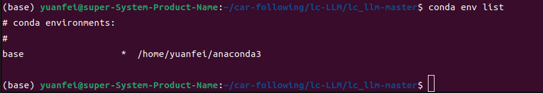
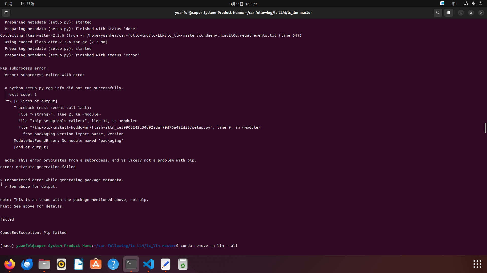
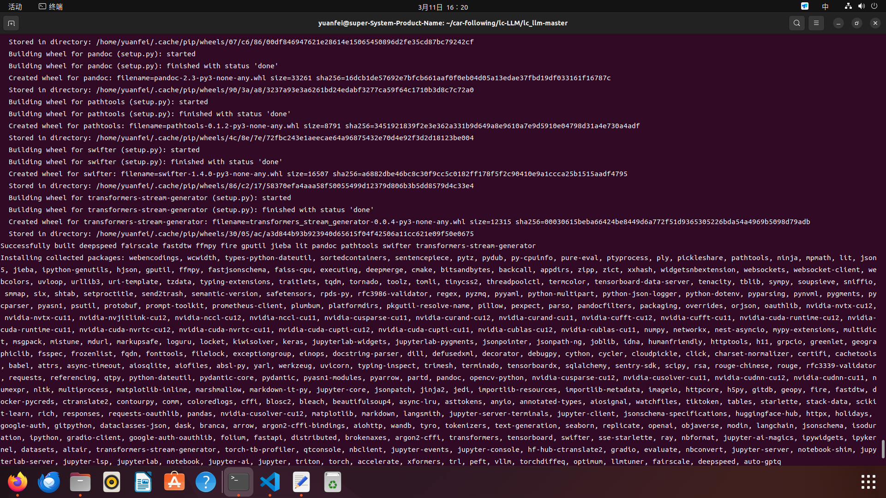
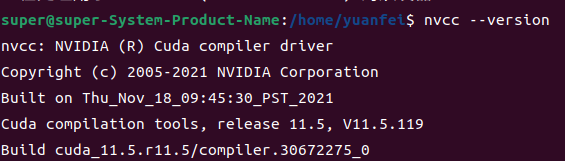
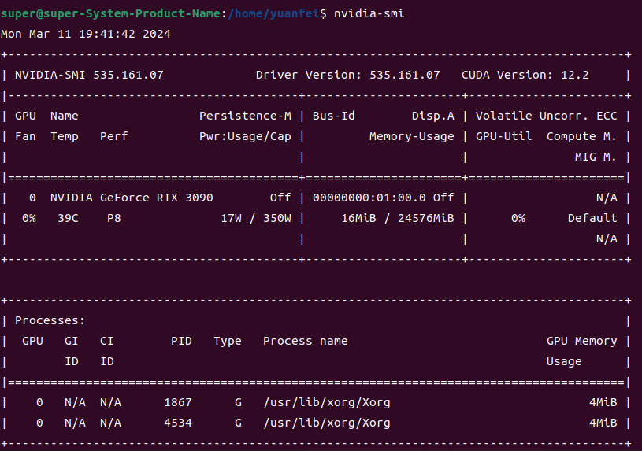
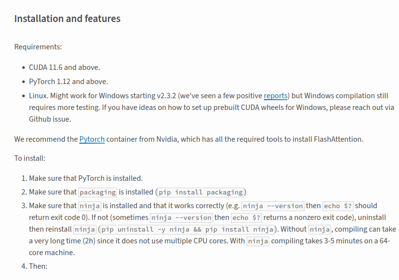
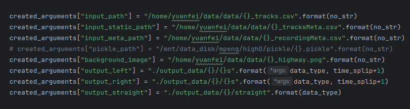

### 2024.3.10
#### 环境配置：
根据readme文件显示，在base环境使用```conda env create -f environment.yaml -n lc_llm```命令根据创建**environment.yaml**文件中包含的库创建lc_llm环境,运行时出现报错，报错信息如下：
```
  Preparing metadata (setup.py): started
  Preparing metadata (setup.py): finished with status 'error'

Pip subprocess error:
  error: subprocess-exited-with-error
  
  × python setup.py egg_info did not run successfully.
  │ exit code: 1
  ╰─> [6 lines of output]
      Traceback (most recent call last):
        File "<string>", line 2, in <module>
        File "<pip-setuptools-caller>", line 34, in <module>
        File "/tmp/pip-install-2eobx_jr/flash-attn_35a12ec663d84bdc9a0efefeb15a4a65/setup.py", line 9, in <module>
          from packaging.version import parse, Version
      ModuleNotFoundError: No module named 'packaging'
      [end of output]
  
  note: This error originates from a subprocess, and is likely not a problem with pip.
error: metadata-generation-failed

× Encountered error while generating package metadata.
╰─> See above for output.

note: This is an issue with the package mentioned above, not pip.
hint: See above for details.

failed

CondaEnvException: Pip failed

```
初步判断原因可能是：
```
Pip subprocess error:
  error: subprocess-exited-with-error
  
  × python setup.py egg_info did not run successfully.
```
查询原因，尝试运行```pip install --upgrade pip setuptools==57.5.0```，[reference网址](https://zhuanlan.zhihu.com/p/633849365)，运行过程中进显示信息如下：
```
(base) yuanfei@super-System-Product-Name:~/car-following/lc-LLM/lc_llm-master$ pip install --upgrade pip setuptools==57.5.0
Requirement already satisfied: pip in /home/yuanfei/anaconda3/lib/python3.11/site-packages (23.3.1)
Collecting pip
  Downloading pip-24.0-py3-none-any.whl.metadata (3.6 kB)
Collecting setuptools==57.5.0
  Downloading setuptools-57.5.0-py3-none-any.whl.metadata (4.9 kB)
Downloading setuptools-57.5.0-py3-none-any.whl (819 kB)
   ━━━━━━━━━━━━━━━━━━━━━━━━━━━━━━━━━━━━━━━━ 819.3/819.3 kB 452.9 kB/s eta 0:00:00
Downloading pip-24.0-py3-none-any.whl (2.1 MB)
   ━━━━━━━━━━━━━━━━━━━━━━━━━━━━━━━━━━━━━━━━ 2.1/2.1 MB 153.5 kB/s eta 0:00:00
Installing collected packages: setuptools, pip
  Attempting uninstall: setuptools
    Found existing installation: setuptools 68.2.2
    Uninstalling setuptools-68.2.2:
      Successfully uninstalled setuptools-68.2.2
  Attempting uninstall: pip
    Found existing installation: pip 23.3.1
    Uninstalling pip-23.3.1:
      Successfully uninstalled pip-23.3.1
ERROR: pip's dependency resolver does not currently take into account all the packages that are installed. This behaviour is the source of the following dependency conflicts.
conda-repo-cli 1.0.75 requires requests_mock, which is not installed.
anaconda-client 1.12.3 requires setuptools>=58.0.4, but you have setuptools 57.5.0 which is incompatible.
conda-repo-cli 1.0.75 requires clyent==1.2.1, but you have clyent 1.2.2 which is incompatible.
conda 24.1.2 requires setuptools>=60.0.0, but you have setuptools 57.5.0 which is incompatible.
Successfully installed pip-24.0 setuptools-57.5.0

```
### 2024.3.11
后续将尝试删除环境重新运行```conda remove --name lc_llm --all```,  ，运行依旧报错。
再次查询资料，资料显示在安装**flash-attn==2.3.6**库时，因为缺少'packaging'模块，导致安装失败。

首先尝试将yaml文件中的```     - packaging==23.2```移到前面尝试重新创建环境。结果依旧不成功。于是先暂时不安装<font color=red>flash-attn</font>,将其从yaml文件中删除。后续手动添加。
成功安装

```
Package                       Version
----------------------------- ------------
absl-py                       2.0.0
accelerate                    0.23.0
aiofiles                      23.2.1
aiohttp                       3.8.6
aiosignal                     1.3.1
aiosqlite                     0.19.0
altair                        5.2.0
annotated-types               0.6.0
anyio                         3.7.1
appdirs                       1.4.4
argon2-cffi                   23.1.0
argon2-cffi-bindings          21.2.0
arrow                         1.3.0
asttokens                     2.4.0
async-lru                     2.0.4
async-timeout                 4.0.3
attrs                         23.1.0
auto-gptq                     0.4.2
Babel                         2.13.0
backcall                      0.2.0
beautifulsoup4                4.12.2
bitsandbytes                  0.41.1
bleach                        6.1.0
blosc2                        2.0.0
branca                        0.6.0
brokenaxes                    0.5.0
cachetools                    5.3.1
certifi                       2023.7.22
cffi                          1.16.0
charset-normalizer            3.3.0
click                         8.1.7
cloudpickle                   3.0.0
cmake                         3.27.7
coloredlogs                   15.0.1
comm                          0.1.4
contourpy                     1.1.1
ctranslate2                   3.20.0
cycler                        0.12.1
Cython                        3.0.4
dask                          2023.5.0
dataclasses-json              0.6.3
datasets                      2.14.5
debugpy                       1.8.0
decorator                     5.1.1
deepmerge                     1.1.0
deepspeed                     0.12.3
defusedxml                    0.7.1
dill                          0.3.7
distributed                   2023.5.0
docker-pycreds                0.4.0
docstring-parser              0.15
einops                        0.7.0
evaluate                      0.4.1
exceptiongroup                1.1.3
executing                     2.0.0
fairscale                     0.4.13
faiss-cpu                     1.7.4
fastapi                       0.104.0
fastdtw                       0.3.4
fastjsonschema                2.18.1
ffmpy                         0.3.1
filelock                      3.12.4
fire                          0.5.0
folium                        0.14.0
fonttools                     4.43.1
fqdn                          1.5.1
frozenlist                    1.4.0
fsspec                        2023.6.0
geographiclib                 2.0
geopy                         2.4.0
gitdb                         4.0.11
GitPython                     3.1.40
google-auth                   2.23.3
google-auth-oauthlib          1.0.0
GPUtil                        1.4.0
gradio                        3.50.2
gradio_client                 0.6.1
greenlet                      3.0.1
grpcio                        1.59.0
h11                           0.14.0
h5py                          3.10.0
hf-hub-ctranslate2            2.12.0
hjson                         3.1.0
holidays                      0.36
httpcore                      1.0.2
httptools                     0.6.1
httpx                         0.25.1
huggingface-hub               0.20.3
humanfriendly                 10.0
idna                          3.4
imageio                       2.33.1
importlib-metadata            6.8.0
importlib-resources           6.1.0
ipykernel                     6.25.2
ipython                       8.12.3
ipython-genutils              0.2.0
ipywidgets                    8.1.1
isoduration                   20.11.0
jedi                          0.19.1
jieba                         0.42.1
Jinja2                        3.1.2
joblib                        1.3.2
json5                         0.9.14
jsonpatch                     1.33
jsonpath-ng                   1.6.0
jsonpointer                   2.4
jsonschema                    4.19.1
jsonschema-specifications     2023.7.1
jupyter                       1.0.0
jupyter_ai                    2.6.0
jupyter_ai_magics             2.6.0
jupyter_client                8.4.0
jupyter-console               6.6.3
jupyter_core                  5.4.0
jupyter-events                0.8.0
jupyter-lsp                   2.2.0
jupyter_server                2.8.0
jupyter_server_terminals      0.4.4
jupyterlab                    4.0.7
jupyterlab-pygments           0.2.2
jupyterlab_server             2.25.0
jupyterlab-widgets            3.0.9
keras                         2.15.0
kiwisolver                    1.4.5
langchain                     0.0.318
langsmith                     0.0.69
lit                           17.0.3
llmtuner                      0.5.1
locket                        1.0.0
loguru                        0.7.2
Markdown                      3.5
markdown-it-py                3.0.0
MarkupSafe                    2.1.3
marshmallow                   3.20.1
matplotlib                    3.7.3
matplotlib-inline             0.1.6
mdurl                         0.1.2
mistune                       3.0.2
modin                         0.23.1.post0
mpmath                        1.3.0
msgpack                       1.0.7
multidict                     6.0.4
multiprocess                  0.70.15
mypy-extensions               1.0.0
nbclient                      0.8.0
nbconvert                     7.9.2
nbformat                      5.9.2
nest-asyncio                  1.5.8
networkx                      3.1
ninja                         1.11.1.1
nltk                          3.8.1
notebook                      7.0.6
notebook_shim                 0.2.3
numexpr                       2.8.6
numpy                         1.24.4
nvidia-cublas-cu11            11.10.3.66
nvidia-cublas-cu12            12.1.3.1
nvidia-cuda-cupti-cu11        11.7.101
nvidia-cuda-cupti-cu12        12.1.105
nvidia-cuda-nvrtc-cu11        11.7.99
nvidia-cuda-nvrtc-cu12        12.1.105
nvidia-cuda-runtime-cu11      11.7.99
nvidia-cuda-runtime-cu12      12.1.105
nvidia-cudnn-cu11             8.5.0.96
nvidia-cudnn-cu12             8.9.2.26
nvidia-cufft-cu11             10.9.0.58
nvidia-cufft-cu12             11.0.2.54
nvidia-curand-cu11            10.2.10.91
nvidia-curand-cu12            10.3.2.106
nvidia-cusolver-cu11          11.4.0.1
nvidia-cusolver-cu12          11.4.5.107
nvidia-cusparse-cu11          11.7.4.91
nvidia-cusparse-cu12          12.1.0.106
nvidia-nccl-cu11              2.14.3
nvidia-nccl-cu12              2.18.1
nvidia-nvjitlink-cu12         12.3.52
nvidia-nvtx-cu11              11.7.91
nvidia-nvtx-cu12              12.1.105
oauthlib                      3.2.2
objaverse                     0.1.7
openai                        0.28.1
opencv-python                 4.8.1.78
optimum                       1.15.0
orjson                        3.9.12
overrides                     7.4.0
packaging                     23.2
pandas                        2.0.3
pandoc                        2.3
pandocfilters                 1.5.0
parso                         0.8.3
partd                         1.4.1
pathtools                     0.1.2
peft                          0.7.1
pexpect                       4.8.0
pickleshare                   0.7.5
Pillow                        10.1.0
pip                           23.3
pkgutil_resolve_name          1.3.10
platformdirs                  3.11.0
plumbum                       1.8.2
ply                           3.11
prometheus-client             0.17.1
prompt-toolkit                3.0.39
protobuf                      3.20.0
psutil                        5.9.6
ptyprocess                    0.7.0
pure-eval                     0.2.2
py-cpuinfo                    9.0.0
pyarrow                       13.0.0
pyasn1                        0.5.0
pyasn1-modules                0.3.0
pycparser                     2.21
pydantic                      1.10.13
pydantic_core                 2.10.1
pydub                         0.25.1
Pygments                      2.16.1
pynvml                        11.5.0
pyparsing                     3.1.1
python-dateutil               2.8.2
python-dotenv                 1.0.0
python-json-logger            2.0.7
python-multipart              0.0.6
pytz                          2023.3.post1
PyYAML                        6.0.1
pyzmq                         25.1.1
qtconsole                     5.4.4
QtPy                          2.4.0
ray                           2.7.1
referencing                   0.30.2
regex                         2023.10.3
replicate                     0.20.0
requests                      2.31.0
requests-oauthlib             1.3.1
responses                     0.18.0
rfc3339-validator             0.1.4
rfc3986-validator             0.1.1
rich                          13.6.0
rouge                         1.0.1
rouge-chinese                 1.0.3
rpds-py                       0.10.6
rsa                           4.9
safetensors                   0.4.0
scikit-learn                  1.3.2
scipy                         1.10.1
seaborn                       0.13.0
semantic-version              2.10.0
Send2Trash                    1.8.2
sentencepiece                 0.1.99
sentry-sdk                    1.32.0
setproctitle                  1.3.3
setuptools                    68.0.0
shtab                         1.6.4
six                           1.16.0
smmap                         5.0.1
sniffio                       1.3.0
sortedcontainers              2.4.0
soupsieve                     2.5
SQLAlchemy                    2.0.23
sse-starlette                 1.8.2
stack-data                    0.6.3
starlette                     0.27.0
swifter                       1.4.0
sympy                         1.12
tables                        3.8.0
tblib                         3.0.0
tenacity                      8.2.3
tensorboard                   2.14.0
tensorboard-data-server       0.7.1
tensorboardX                  2.6.2.2
termcolor                     2.3.0
terminado                     0.17.1
text-generation               0.6.1
threadpoolctl                 3.2.0
tiktoken                      0.5.2
tinycss2                      1.2.1
tokenizers                    0.15.1
tomli                         2.0.1
toolz                         0.12.0
torch                         2.0.1
torch-tb-profiler             0.4.3
torchdiffeq                   0.2.3
tornado                       6.3.3
tqdm                          4.66.1
traitlets                     5.11.2
transformers                  4.37.0
transformers-stream-generator 0.0.4
trimesh                       4.0.5
triton                        2.0.0
trl                           0.7.10
types-python-dateutil         2.8.19.14
typing_extensions             4.8.0
typing-inspect                0.9.0
tyro                          0.7.0
tzdata                        2023.3
uri-template                  1.3.0
urllib3                       2.0.7
uvicorn                       0.23.2
uvloop                        0.19.0
vllm                          0.2.1.post1
wandb                         0.16.0
watchfiles                    0.21.0
wcwidth                       0.2.8
webcolors                     1.13
webencodings                  0.5.1
websocket-client              1.6.4
websockets                    11.0.3
Werkzeug                      3.0.0
wheel                         0.41.2
widgetsnbextension            4.0.9
xformers                      0.0.22
xxhash                        3.4.1
yarl                          1.9.2
zict                          3.0.0
zipp                          3.17.0

```
#### 记录（关于flash-attn==2.3.6）
其余库都安装完毕，flash-attn==2.3.6库仍然安装出现问题
，按照显示，通过```sudo apt-get install git```安装git，随后继续重新安装flash-attn==2.3.6
仍然出现问题：
```
(llm) yuanfei@super-System-Product-Name:~/car-following/lc-LLM/lc_llm-master$ pip install flash-attn==2.3.6
Collecting flash-attn==2.3.6
  Using cached flash_attn-2.3.6.tar.gz (2.3 MB)
  Preparing metadata (setup.py) ... error
  error: subprocess-exited-with-error
  
  × python setup.py egg_info did not run successfully.
  │ exit code: 1
  ╰─> [20 lines of output]
      fatal: 不是 git 仓库（或者任何父目录）：.git
      /tmp/pip-install-xjjtr5k8/flash-attn_a5818fec23644f44a7eb4e93278f2751/setup.py:78: UserWarning: flash_attn was requested, but nvcc was not found.  Are you sure your environment has nvcc available?  If you're installing within a container from https://hub.docker.com/r/pytorch/pytorch, only images whose names contain 'devel' will provide nvcc.
        warnings.warn(
      Traceback (most recent call last):
        File "<string>", line 2, in <module>
        File "<pip-setuptools-caller>", line 34, in <module>
        File "/tmp/pip-install-xjjtr5k8/flash-attn_a5818fec23644f44a7eb4e93278f2751/setup.py", line 133, in <module>
          CUDAExtension(
        File "/home/yuanfei/anaconda3/envs/llm/lib/python3.8/site-packages/torch/utils/cpp_extension.py", line 1048, in CUDAExtension
          library_dirs += library_paths(cuda=True)
        File "/home/yuanfei/anaconda3/envs/llm/lib/python3.8/site-packages/torch/utils/cpp_extension.py", line 1179, in library_paths
          if (not os.path.exists(_join_cuda_home(lib_dir)) and
        File "/home/yuanfei/anaconda3/envs/llm/lib/python3.8/site-packages/torch/utils/cpp_extension.py", line 2223, in _join_cuda_home
          raise EnvironmentError('CUDA_HOME environment variable is not set. '
      OSError: CUDA_HOME environment variable is not set. Please set it to your CUDA install root.
      
      
      torch.__version__  = 2.0.1+cu117
      
      
      [end of output]
  
  note: This error originates from a subprocess, and is likely not a problem with pip.
error: metadata-generation-failed

× Encountered error while generating package metadata.
╰─> See above for output.

note: This is an issue with the package mentioned above, not pip.
hint: See above for details.
(llm) yuanfei@super-System-Product-Name:~/car-following/lc-LLM/lc_llm-master$ pip install flash-attn==2.3.6
Collecting flash-attn==2.3.6
  Using cached flash_attn-2.3.6.tar.gz (2.3 MB)
  Preparing metadata (setup.py) ... error
  error: subprocess-exited-with-error
  
  × python setup.py egg_info did not run successfully.
  │ exit code: 1
  ╰─> [12 lines of output]
      fatal: 不是 git 仓库（或者任何父目录）：.git
      Traceback (most recent call last):
        File "<string>", line 2, in <module>
        File "<pip-setuptools-caller>", line 34, in <module>
        File "/tmp/pip-install-7gv7p569/flash-attn_99114eaeeeb145829d88d6f30f4439e9/setup.py", line 114, in <module>
          raise RuntimeError(
      RuntimeError: FlashAttention is only supported on CUDA 11.6 and above.  Note: make sure nvcc has a supported version by running nvcc -V.
      
      
      torch.__version__  = 2.0.1+cu117
      
      
      [end of output]
  
  note: This error originates from a subprocess, and is likely not a problem with pip.
error: metadata-generation-failed

× Encountered error while generating package metadata.
╰─> See above for output.

note: This is an issue with the package mentioned above, not pip.
hint: See above for details.

```
通过nvcc -version查询CUDA编译器版本，显示
```
找不到命令 “nvcc”，但可以通过以下软件包安装它：
sudo apt install nvidia-cuda-toolkit
```
安装好后进行查询，显示

但是我通过nvidia-smi查询出来是

而且根据[关于flash-attn==2.3.6](https://pypi.org/project/flash-attn/)显示，需要CUDA11.6以上。

暂时放弃安装flash-attn==2.3.6，看后续是否会出问题。出问题再重新安装[后续尝试这个方法](https://juejin.cn/post/7277802797470580771)


### 2024.3.12
#### 复现LC_extraction.py
首先复现的是LC_extraction.py，将代码中的路径改为highD数据集所在的路径，发现data数据集中并无pickle文件夹，暂时注释运行

，运行过程中有问题，
```
/home/yuanfei/anaconda3/envs/llm/bin/python /home/yuanfei/PycharmProjects/lc_llm/lc_llm-master/process_highD/LC_extraction-new.py 
Try to find the saved pickle file for better performance.
Pickle file not found, csv will be imported now.
Traceback (most recent call last):
  File "/home/yuanfei/PycharmProjects/lc_llm/lc_llm-master/process_highD/LC_extraction-new.py", line 100, in <module>
    tracks = read_track_csv(created_arguments)
  File "/home/yuanfei/PycharmProjects/lc_llm/lc_llm-master/process_highD/data_management/read_csv.py", line 74, in read_track_csv
    df = pandas.read_csv(arguments["input_path"])
  File "/home/yuanfei/anaconda3/envs/llm/lib/python3.8/site-packages/pandas/io/parsers/readers.py", line 912, in read_csv
    return _read(filepath_or_buffer, kwds)
  File "/home/yuanfei/anaconda3/envs/llm/lib/python3.8/site-packages/pandas/io/parsers/readers.py", line 577, in _read
    parser = TextFileReader(filepath_or_buffer, **kwds)
  File "/home/yuanfei/anaconda3/envs/llm/lib/python3.8/site-packages/pandas/io/parsers/readers.py", line 1407, in __init__
    self._engine = self._make_engine(f, self.engine)
  File "/home/yuanfei/anaconda3/envs/llm/lib/python3.8/site-packages/pandas/io/parsers/readers.py", line 1661, in _make_engine
    self.handles = get_handle(
  File "/home/yuanfei/anaconda3/envs/llm/lib/python3.8/site-packages/pandas/io/common.py", line 859, in get_handle
    handle = open(
FileNotFoundError: [Errno 2] No such file or directory: '/home/yuanfei/data/data/01_tracks.csv'

Process finished with exit code 1
```
换成一个原始**LC_extraction.py**代码，将**data**文件夹移到*LC_extraction.py**上一级目录，同级目录建立一个output_data,再次运行。程序成功运行。
运行完发现在data文件夹多了.pickle文件，尝试将所有的文件打包成pickle文件夹，重新运行原来的**LC_extraction.py**代码（重命名为LC_extraction-new.py）,运行后代码成功运行。

###
#### LC_extraction.py学习笔记1

这段代码主要是用于从多个文件中提取数据，并进行一些处理后保存。下面是对代码的注释和解释：

created_arguments = create_args()

创建了一个名为created_arguments的变量，通过调用create_args()函数来初始化参数。
for file_idx in range(1, 61):

遍历60个文件，文件编号从1到60。
文件路径设置：

根据文件编号构建各个文件的路径，包括输入路径、静态信息路径、元数据路径、pickle文件路径和背景图像路径。
读取数据：

尝试查找保存的pickle文件以提高性能，如果存在则直接加载，否则从csv文件导入数据，并保存为pickle文件。
处理静态信息和元数据：

分别读取静态信息和元数据，如果文件缺失或包含不正确的字符则报错并退出。
提取数据：

获取帧率，若不为25则提示数据帧率不正确。
构建当前场景信息和选定车辆数据列表。
针对每辆车辆进行处理，选择符合条件的目标车辆，提取相关数据片段。
构建包括目标车辆和周围车辆信息的数据片段列表。
保存数据：

将当前场景提取的数据保存为.pkl文件，文件名包括文件编号。
